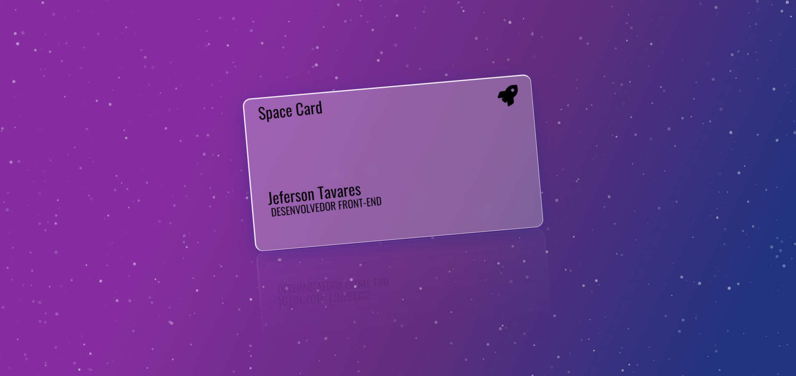

# Estudos para Front-end

> Meus projetos desenvolvidos para estudar e melhorar minhas habilidades como programador Front-end

## ⭐ Exercícios/desafios destacáveis

> Criação de um cartão utilizando efeitos de blur, transparência, gradients e particulas.

----

> Clone das páginas de login do Instagram

